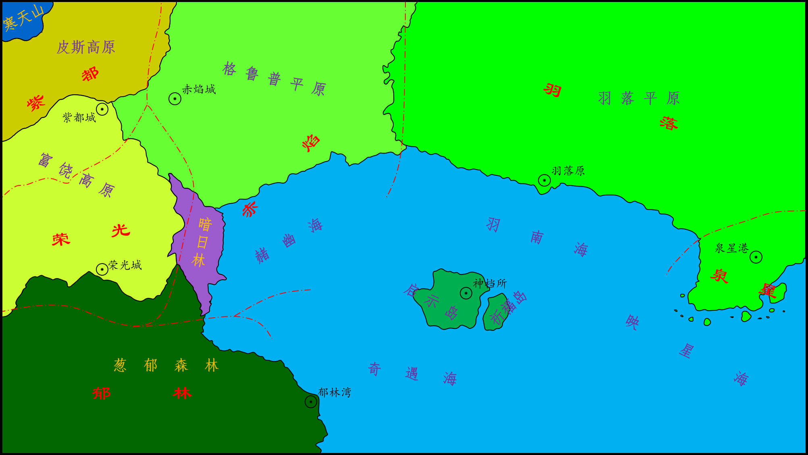

# 大陆志 / 政体

> *六国各自有各自的风格，正如他们的神一样。我就不一样了，有一片自己的岛自己玩多快乐。*
>
> ——*洛青羽*

弗莱大陆采用**六国协会为辅，六国政府与神档所为主**的联合议政方式。

## 六国政府与神档所

弗莱大陆有六个国家，分别有着自己的代表颜色和意义。每个国家独立管辖，分别隶属于六位神灵。

### 主要信息

| 代表色 |  国家要素属性   | 神灵称谓(名字) / 性别 | 国家政体名 | 国家都城名 |
| :----: | :-------------: | :-------------------: | :--------: | :--------: |
|   红   |   团结 Unity    |       优耐蒂 ♀        |    赤焰    |   赤焰城   |
|   橙   |   富饶 Wealth   |       维尔斯 ♂        |    荣光    |   荣光城   |
|   黄   |   活力 Vigor    |        维格 ♂         |    羽落    |   羽落原   |
|   绿   |   自然 Nature   |        奈喆 ♀         |    郁林    |   郁林湾   |
|   蓝   |    冒险 Risk    |       瑞斯克 ♂        |    泉星    |   泉星港   |
|   紫   |    沉静 Calm    |        卡暮 ♀         |    紫都    |   紫都城   |
|   青   | 启示 Revelatory |       洛青羽 ♂        |    - -     |   神档所   |

### 地域分布

见《弗莱大地图》。

### 神档所

严格来说，神档所不属于政体。神档所由洛青羽所组建，负责弗莱大陆的弗莱网建设，并一定程度上参与各国议政。

神档所也是六神生活和办公的主要地点。

## 六国协会

由弗莱人民所组成的**民主管理协会**，简称**六协**。六国协会分布在大陆各地，以弗莱网为依托进行远程办公。

六国协会一般只会在全大陆性的会谈中出面，代表弗莱民众参与会谈。

六国协会大多情况下的主要任务是收集民生建议和帮助民生，总部设立在启示岛。

### 六协会议

六国协会每年会举办两次会议，讨论关于弗莱民众提出的建议。

同时，神座会谈前半个月，六国协会一般会举办一次六协会议。

如果有特殊情况，六协会额外举办会议，额外举办的会议一般是在弗莱网进行远程商讨。

## 大陆会谈

大陆会谈是全大陆性的会议，一般两年一次。分为**神座会谈**和**大陆会谈**两部分。

### 神座会谈

神座会谈举办之前，七神会在启示岛集合。神座会谈一般是商讨部分较大的决议，从而形成草案。在神座会谈期间，七神能够一定程度上和界灵沟通。

### 大陆会谈

神座会谈进行时，六国协会派代表团赴启示岛，并在神座会谈结束两天后和七神会面议事，这次议事便是大陆会谈。七神会将部分神座会谈形成的草案和六协代表团讨论，并一定程度上六协所提出的意见，最终形成结果。

大陆会谈的结果会由六神向各区域的管理者传达，也会由六国协会向弗莱民众讲述。

# Dimote

[返回大陆志主页](index.md/)