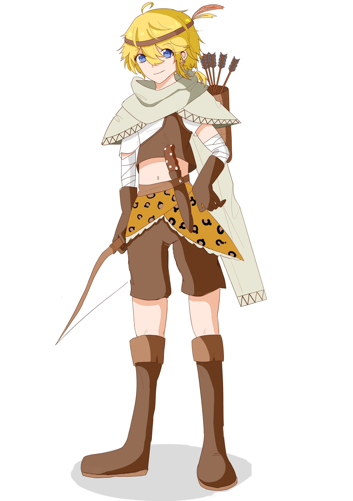

# 泉星 / 林墨

> *林墨他……承受了太多。*
>
> ——*洛青羽*

## 基本信息

**【名字】** 林墨

**【称号】** 

**【身份】** 猎手

**【性别】** 女(第二形态男)

> 只有为数不多的人知道，男性的他并不是林墨的本来面目。  
> 为了遮掩自己原本的样子，林墨付出了很大的代价。

**【物种】** 非银狼

**【年龄】** 17

**【生日】** 

**【身高】** 

**【体重】** 

## 人物状况

**【神格等级】** A

**【体质水平】** A

**【体能水平】** B

**【逻辑水平】** A

**【专注水平】** C

**【统筹水平】** B

## 性格与外貌

### 性格

### 外貌

第二形态设定图：

### 喜恶

### 征召发言

## 角色档案

### 简历

### 身世背景

### 人际交往

### 社会舆论

### 人物故事

## 星梦联合相关档案

**【星梦联合定位】** 耀星-冒险者

**【擅长的武器】** 弓

**【能力】** 

### 固有技能概述

林墨站场时，对非人形敌人的伤害提升；在场但不站场时，对非人形敌人的伤害小幅提升。

### 主动技能概述

**【在场技能】** 

布置陷阱，陷阱在存在时间内对敌人有嘲讽功能；敌人接触陷阱时陷阱会消失，小体型敌人会被晕眩，大体型敌人会被降低移动速度，并且均会造成一定伤害。

**【站场技能】** 能量消耗：20点。

林墨将箭矢替换成猎刀，蓄力后向前弹射，对弹射路径内的敌人造成伤害，对落点处的敌人附着流血效果并造成大量伤害。

## 资料附注

全文由「三金羊Sheep」撰写。

# Dimote

[https://dimote.top/](https://dimote.top/) > [主页](../../index.md) > [人物志主页](index.md) > 林墨
